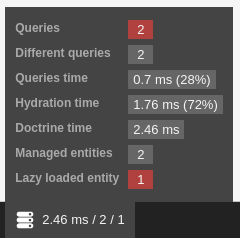
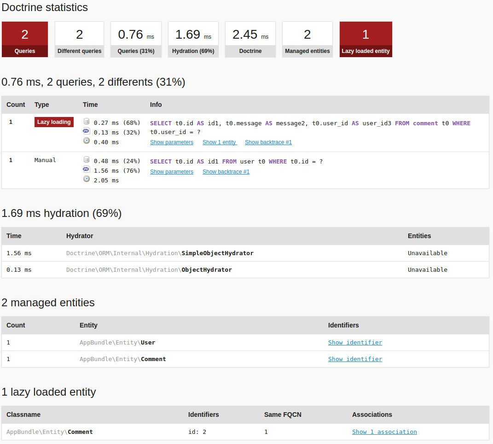

[](https://github.com/steevanb/doctrine-stats/tree/1.4.0)
[](http://www.doctrine-project.org)
[](http://www.php.net)


[](https://scrutinizer-ci.com/g/steevanb/doctrine-stats/)

### doctrine-stats

Add important Doctrine statistics :
* Count managed entities
* Count lazy loaded entities
* Hydration time by hydrator and query
* Group queries by query string, show differents parameters used by same query string
* Count different query string used

[Changelog](changelog.md)

### Installation

```bash
composer require --dev "steevanb/doctrine-stats": "^1.4"
```

If you want to add hydration time to your statistics :

```json
# composer.json
{
    "require-dev": {
        "steevanb/composer-overload-class": "^1.1"
    },
    "autoload": {
        "psr-4": {
            "ComposerOverloadClass\\": "var/cache/ComposerOverloadClass"
        }
    },
    "scripts": {
        "pre-autoload-dump": "steevanb\\ComposerOverloadClass\\OverloadClass::overload"
    },
    "extra": {
        "composer-overload-cache-dir": "var/cache",
        "composer-overload-class-dev": {
            "Doctrine\\ORM\\Internal\\Hydration\\ArrayHydrator": {
                "original-file": "vendor/doctrine/orm/lib/Doctrine/ORM/Internal/Hydration/ArrayHydrator.php",
                "overload-file": "vendor/steevanb/doctrine-stats/ComposerOverloadClass/Doctrine/ORM/Internal/ArrayHydrator.php"
            },
            "Doctrine\\ORM\\Internal\\Hydration\\ObjectHydrator": {
                "original-file": "vendor/doctrine/orm/lib/Doctrine/ORM/Internal/Hydration/ObjectHydrator.php",
                "overload-file": "vendor/steevanb/doctrine-stats/ComposerOverloadClass/Doctrine/ORM/Internal/ObjectHydrator.php"
            },
            "Doctrine\\ORM\\Internal\\Hydration\\ScalarHydrator": {
                "original-file": "vendor/doctrine/orm/lib/Doctrine/ORM/Internal/Hydration/ScalarHydrator.php",
                "overload-file": "vendor/steevanb/doctrine-stats/ComposerOverloadClass/Doctrine/ORM/Internal/ScalarHydrator.php"
            },
            "Doctrine\\ORM\\Internal\\Hydration\\SimpleObjectHydrator": {
                "original-file": "vendor/doctrine/orm/lib/Doctrine/ORM/Internal/Hydration/SimpleObjectHydrator.php",
                "overload-file": "vendor/steevanb/doctrine-stats/ComposerOverloadClass/Doctrine/ORM/Internal/SimpleObjectHydrator.php"
            },
            "Doctrine\\ORM\\Internal\\Hydration\\SingleScalarHydrator": {
                "original-file": "vendor/doctrine/orm/lib/Doctrine/ORM/Internal/Hydration/SingleScalarHydrator.php",
                "overload-file": "vendor/steevanb/doctrine-stats/ComposerOverloadClass/Doctrine/ORM/Internal/SingleScalarHydrator.php"
            }
        }
    }
}
```
```bash
composer update steevanb/composer-overload-class
```

### Symfony integration

Read Installation paragraph before.

#### Symfony 2.x, 3.x and 4.x

_Use version 1.3.x of this bundle._

#### Symfony 5.x

```php
### config/bundles.php
return [
    // ...
    \steevanb\DoctrineStats\Bridge\DoctrineStatsBundle\DoctrineStatsBundle::class => ['dev' => true],
];
```

If you want to add lazy loaded entities to your statistics:

```yml
### config/services_dev.yaml (you may have to create that file)
parameters:
    doctrine.orm.entity_manager.class: steevanb\DoctrineStats\Doctrine\ORM\EntityManager
```

### Manual integration

To retrieve statistics, you need to register steevanb\DoctrineStats\EventSubscriber\DoctrineEventSubscriber in your event manager.

If you want to add lazy loaded entities to your statistics, you need to overload default EntityManager, with steevanb\DoctrineStats\Doctrine\ORM\EntityManager.

### Screenshots




